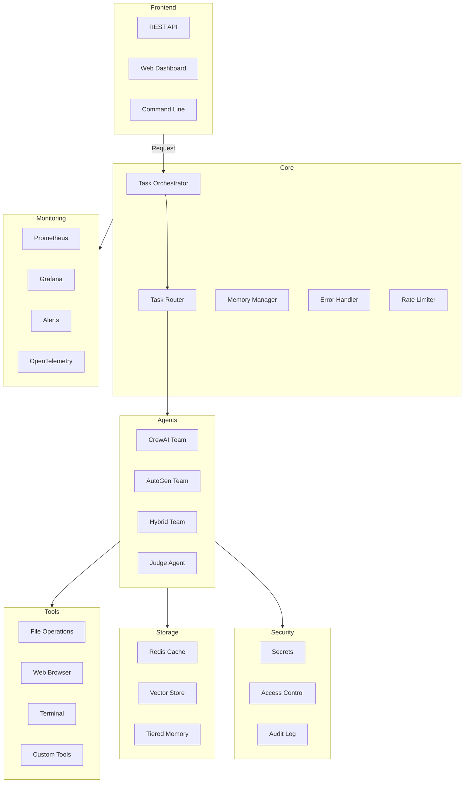

# AMAOS Architecture

## System Overview

AMAOS is designed as a cloud-native, distributed system with the following key architectural principles:

- **Modularity**: Loosely coupled components for easy extensibility
- **Reliability**: Built-in fault tolerance and graceful degradation
- **Scalability**: Horizontal scaling and load balancing
- **Observability**: Comprehensive monitoring and tracing
- **Security**: Defense-in-depth approach with multiple security layers

## Core Components

### Task Orchestrator

The central coordinator that:
- Routes tasks to appropriate agents
- Manages task dependencies and execution flow
- Handles retries and fallbacks
- Enforces rate limits and circuit breaking

### Agent System

Multiple agent types with different capabilities:
- **CrewAI Teams**: Structured task execution with role-based agents
- **AutoGen Teams**: Conversational problem-solving with emergent behavior
- **Hybrid Teams**: Combined capabilities for complex workflows
- **Judge Agent**: Quality assurance and output validation

### Memory Management

Multi-tiered memory system:
- **Redis Cache**: Fast access to recent data
- **Vector Store**: Semantic search and long-term storage
- **Tiered Memory**: Automatic data lifecycle management

### Tool Layer

Extensible tool system with:
- File operations
- Web interactions
- Terminal commands
- Custom tool support
- Tool sandboxing

### Security Layer

Defense-in-depth approach:
- **Secrets Management**: Secure key storage and rotation
- **RBAC**: Fine-grained access control
- **Network Policies**: Strict communication rules
- **Audit Logging**: Comprehensive activity tracking

### Monitoring Stack

Full observability suite:
- **Prometheus**: Metric collection
- **Grafana**: Visualization and dashboards
- **Alert Manager**: Intelligent alerting
- **Distributed Tracing**: Request tracking

## Component Interactions

## Deployment Architecture

### Development Environment
- Local Docker Compose setup
- Hot reloading for development
- Local monitoring stack

### Production Environment
- Kubernetes-based deployment
- Horizontal pod autoscaling
- Load balancing and ingress control
- Distributed secret management
- High availability configuration

## Security Architecture

### Authentication & Authorization
- API key authentication
- Role-based access control
- Fine-grained permissions
- Token-based agent access

### Data Protection
- Encryption at rest
- Secure communication
- Secret rotation
- Data lifecycle management

### Network Security
- Network policies
- Service mesh integration
- Ingress/egress control
- TLS everywhere

## Scalability

### Horizontal Scaling
- Stateless components
- Distributed caching
- Load balancing
- Auto-scaling

### Performance Optimization
- Rate limiting
- Circuit breaking
- Connection pooling
- Resource quotas

## Monitoring & Observability

### Metrics
- System metrics
- Business metrics
- SLO monitoring
- Cost tracking

### Logging
- Structured logging
- Log aggregation
- Audit logging
- Log retention

### Tracing
- Distributed tracing
- Request tracking
- Performance analysis
- Bottleneck detection

## Future Considerations

1. **Edge Computing Support**
   - Edge agent deployment
   - Local processing capabilities
   - Reduced latency for time-critical tasks

2. **Advanced AI Features**
   - Multi-modal agent support
   - Advanced reasoning capabilities
   - Improved coordination mechanisms

3. **Enhanced Security**
   - Hardware security modules
   - Advanced threat detection
   - Zero-trust architecture

4. **Improved Observability**
   - AI-powered monitoring
   - Predictive analytics
   - Automated optimization
